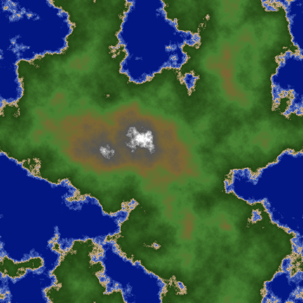

# Experiments in Terrain Generation & Rendering

## Heightmap Generation

This project implements a Diamond-Square algorithm for generating fractal maps and terrain. The generated maps can be saved as PNG images.

The core generation method is based on the Diamond-Square algorithm, which is a popular method for generating fractal terrain.

## Usage

### Command Line Version

To generate a terrain image, use the makefile provided.

```bash
make
```

This will generate a PNG image and save it as `output/map.png`.

### Web Version (WASM)

A web-based version is available that runs in a browser using WebAssembly:

```bash
make web
```

This will:

1. Compile the Go code to WebAssembly
2. Start a local web server on http://localhost:8080
3. Open the interactive terrain generator in your browser

The web version includes:

- Real-time parameter adjustment (roughness and seed)
- Interactive controls with live preview
- Random seed generation
- Same high-quality terrain generation as the CLI version

See [web/README.md](web/README.md) for more details about the web version.

Example



## License

This project is licensed under the MIT License. See the [LICENSE](LICENSE) file for details
