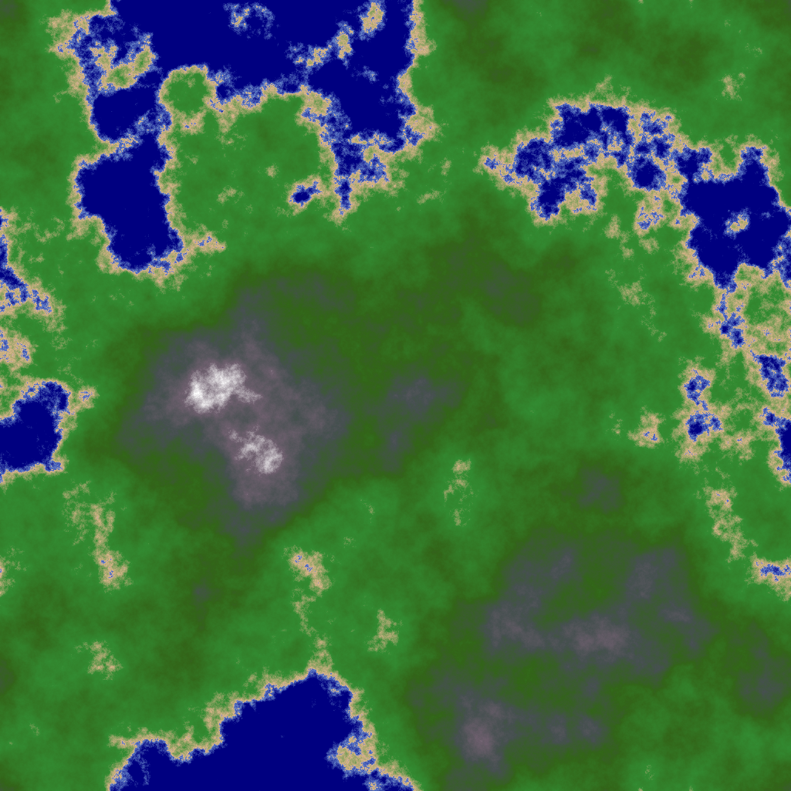

# Experiments in terrain generation and rendering

## Heightmap Generation

This project implements a Diamond-Square algorithm for generating heightmaps. The generated heightmaps can be saved as PNG images.  
The heightmap generation is based on the Diamond-Square algorithm, which is a popular method for generating fractal terrain.

## Usage

### Command Line Version

To generate a heightmap, run the `main.go` file in the `heightmap` directory:

```bash
make
```

This will generate a heightmap and save it as `heightmap.png` in the current directory.

### Web Version (WASM)

A web-based version is available that runs in your browser using WebAssembly:

```bash
make web
```

This will:

1. Compile the Go code to WebAssembly
2. Start a local web server on http://localhost:8080
3. Open the interactive terrain generator in your browser

The web version includes:

- Real-time parameter adjustment (roughness and seed)
- Interactive controls with live preview
- Random seed generation
- Same high-quality terrain generation as the CLI version

See [web/README.md](web/README.md) for more details about the web version.

Example



## License

This project is licensed under the MIT License. See the [LICENSE](LICENSE) file for details
