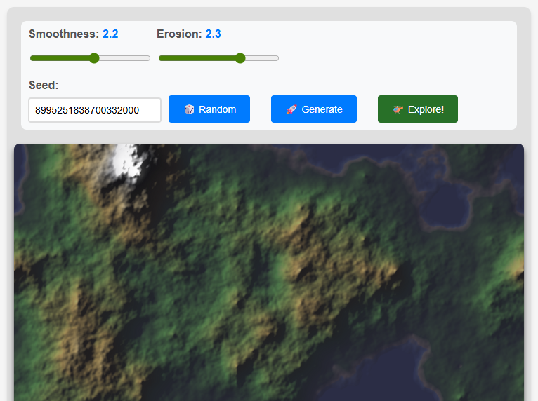

# Terrain Generation & Voxel Rendering

A project exploring procedural terrain generation using fractal algorithms, and voxel based rendering techniques. It takes inspiration from classic terrain generation software such as Vista Pro on the Amiga, and also the classic VoxelSpace rendering technique as shown in the https://github.com/s-macke/VoxelSpace repo

It uses a mixture of Go, WebAssembly & modern JS to deliver high-performance terrain generation and visualization.




## Features

### 🏔️ Terrain Generation

- **Diamond-Square Algorithm**: Fractal terrain generation with periodic boundaries for seamless tiling
- **Advanced Post-Processing**: Normalization, erosion simulation, blur filtering, and sea level adjustment
- **Realistic Color Gradients**: Multi-layered terrain coloring from deep water to snow-capped peaks
- **Dynamic Lighting**: Sobel-based normal mapping with configurable ambient and diffuse lighting

### 🌐 Web Applications

- **Interactive Generator**: Real-time terrain generation in the browser using WebAssembly
- **Voxel Space Renderer**: 3D terrain exploration with camera controls and LOD optimization
- **Parameter Control**: Adjustable smoothness, erosion, and random seed generation

### 🖥️ Command Line Interface

- Configurable map size (2^n + 1 resolution)
- Customizable smoothing and erosion parameters
- Height-encoded alpha channels for 3D rendering
- PNG output with lighting effects

### 🔧 Technical Features

- **WebAssembly Integration**: Go compiled to WASM for browser-based terrain generation
- **Modular Architecture**: Separated packages for generation, gradients, and post-processing
- **Performance Optimized**: Efficient algorithms with distance-based level of detail

## Getting Started

### Prerequisites

- Go 1.24.5 or later
- A modern web browser with WebAssembly support
- Python 3 (for local web server)

### Building and Running

#### Command Line Interface

Generate terrain maps directly from the command line:

```bash
# Generate with default parameters
make cli-run

# Or run directly with custom parameters
go run generate/cli/main.go -size 10 -seed 12345 -smooth 2.0 -erosion 1.8 -out output/custom.png
```

**CLI Parameters:**

- `-size`: Map resolution as 2^size (default: 9, range: 1-12)
- `-seed`: Random seed for reproducible generation (default: random)
- `-smooth`: Terrain smoothing factor (default: 1.78)
- `-erosion`: Erosion simulation strength (default: 1.9)
- `-out`: Output file path (default: output/map.png)
- `-heightAlpha`: Encode height data in alpha channel (default: true)

#### Web Applications

**Interactive Terrain Generator:**

```bash
# Build and serve the web application
make web

# Or build and serve separately
make web-build
make web-serve
```

Visit `http://localhost:8000/generate/` to access the interactive terrain generator with real-time parameter adjustment.

**Voxel Space Explorer:**
After generating terrain in the web interface, click "🚁 Explore!" to view the terrain in 3D using a voxel space renderer. Navigate with WASD keys and mouse controls.

### Development

```bash
# Clean generated files
make clean

# View all available make targets
make help
```

## Architecture

### Core Packages

**`pkg/generation/`**

- `diamond-square.go`: Implementation of the Diamond-Square fractal algorithm with periodic boundary conditions

**`pkg/gradients/`**

- `gradients.go`: Color gradient definitions for realistic terrain coloring (water, sand, grass, rock, snow)

**`pkg/postprocess/`**

- `postprocess.go`: Terrain enhancement functions including normalization, erosion, blur, and sea level adjustment

### Applications

**`generate/cli/`**

- Command-line tool for batch terrain generation with full parameter control and PNG output

**`generate/web/`**

- WebAssembly build target providing browser-based terrain generation via JavaScript bindings

**`web/generate/`**

- Interactive web interface with real-time parameter controls and preview

**`web/voxel/`**

- Voxel space terrain renderer with camera controls, LOD optimization, and atmospheric effects

## Algorithm Details

### Diamond-Square Implementation

The terrain generator uses an enhanced Diamond-Square algorithm featuring:

- **Periodic Boundaries**: Ensures seamless tiling for large terrain systems
- **Configurable Roughness**: Controls terrain feature scale and variation
- **Predictable Seeding**: Reproducible terrain generation for consistent results

### Rendering Pipeline

1. **Height Generation**: Diamond-Square algorithm creates base elevation data
2. **Normalization**: Values mapped to [0,1] range for consistent processing
3. **Erosion Simulation**: Power function reshapes elevation distribution
4. **Smoothing**: Box blur reduces sharp artifacts
5. **Sea Level**: Minimum elevation clamping for water bodies
6. **Lighting**: Sobel edge detection generates surface normals for realistic shading
7. **Coloring**: Multi-stop gradient mapping based on elevation zones

## Examples

**Generated terrain features realistic geographic elements:**

- Deep water (dark blue) → shallow water (light blue) → beaches (sand)
- Lowlands (dark green) → hills (light green) → mountains (brown/gray)
- High peaks with snow caps (white)
- Realistic lighting and shadows enhance 3D appearance

The voxel space renderer provides an immersive exploration experience with:

- Smooth camera movement and rotation
- Distance-based level of detail for performance
- Atmospheric perspective and lighting effects

## References

The voxel space rendering technique is inspired by the classic approach documented in [VoxelSpace](https://github.com/s-macke/VoxelSpace) by Sebastian Macke, which demonstrates the elegant raycasting method used in games like Comanche.

## License

This project is open source. See the LICENSE file for details.
